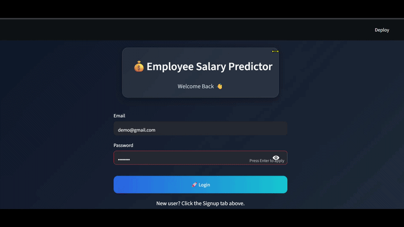
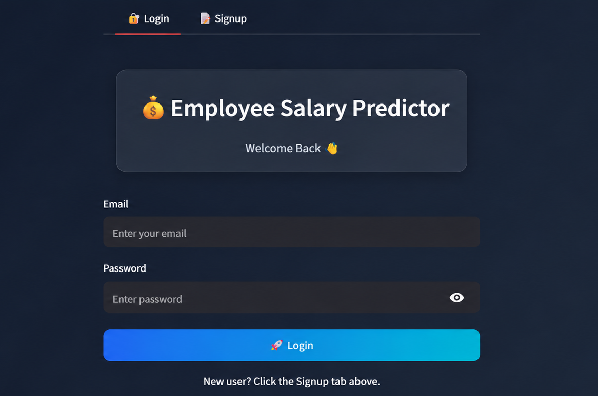
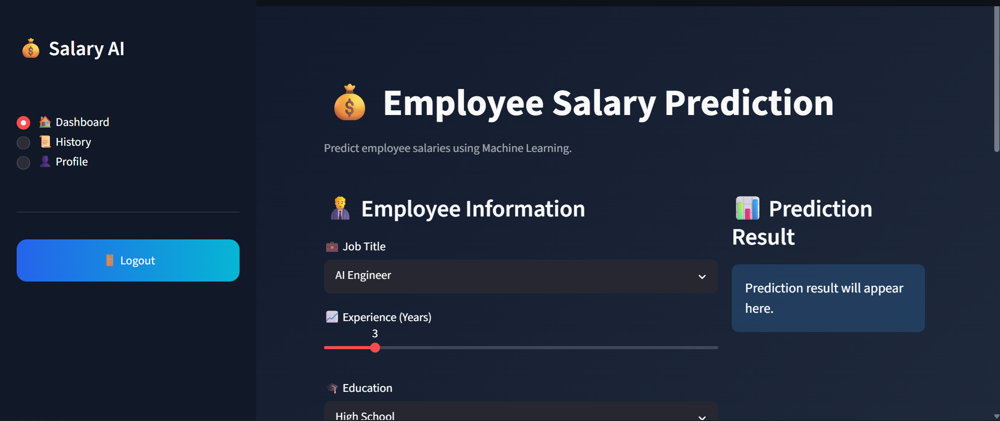
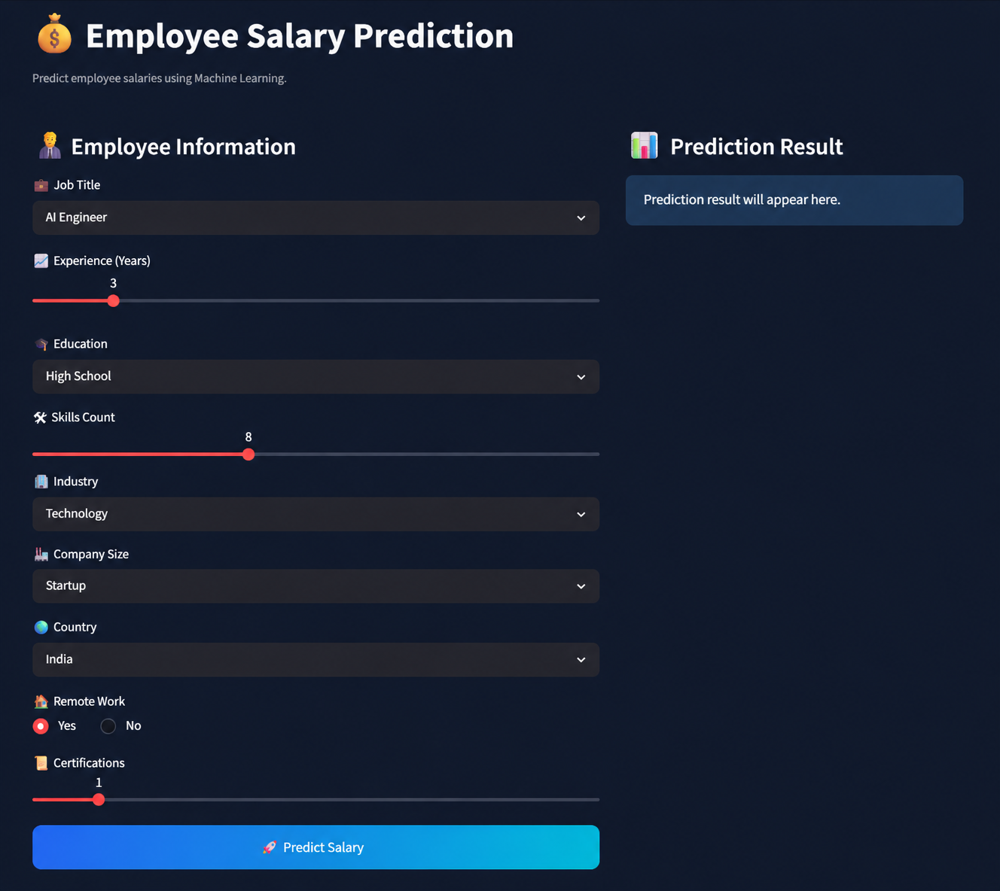
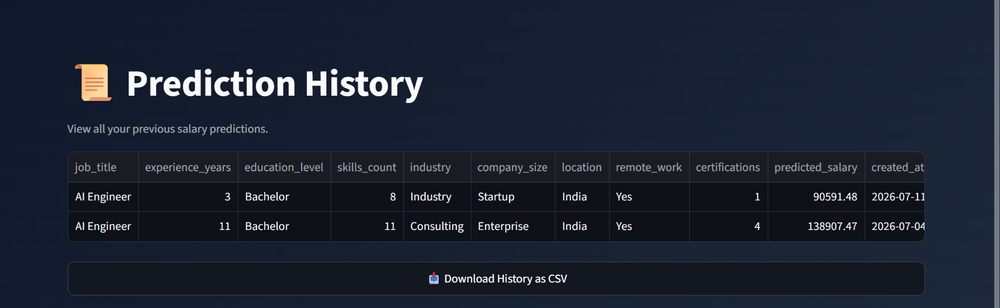
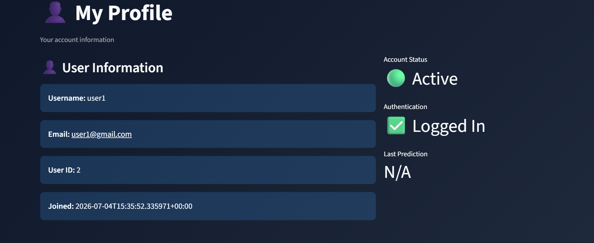
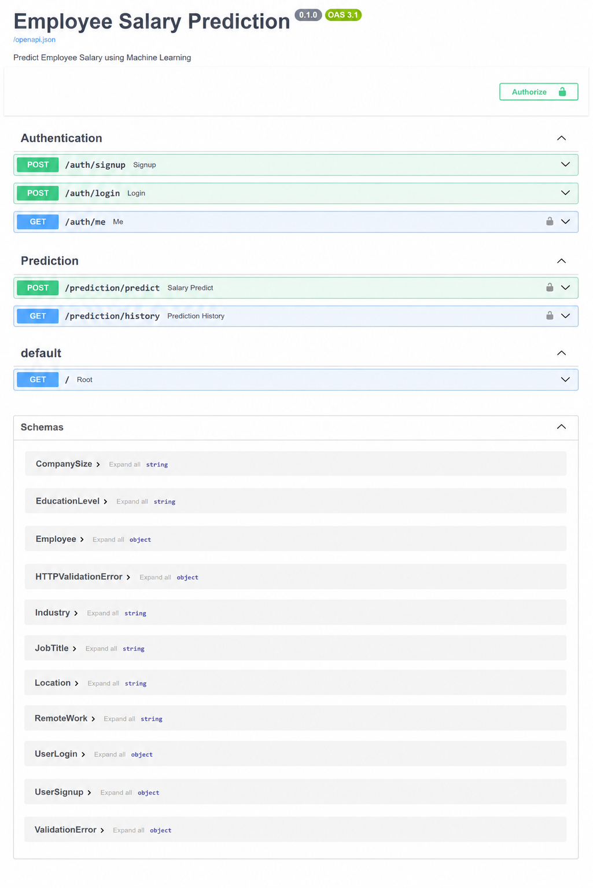

# 💼 Employee Salary Prediction System

An end-to-end **Machine Learning Web Application** that predicts an employee's salary based on professional information such as job role, experience, education, skills, industry, company size, location, remote work, and certifications.

The project combines a trained **XGBoost Machine Learning model**, **FastAPI backend**, **JWT Authentication**, **PostgreSQL database**, and a **Streamlit frontend** to deliver a complete production-style application.

---

# 🚀 Live Demo

### 🌐 Frontend

https://employee-salary-prediction123.streamlit.app/

### ⚡ Backend API

https://employee-salary-prediction-frzc.onrender.com

### 📘 Swagger Documentation

https://employee-salary-prediction-frzc.onrender.com/docs

---

# 🎥 Demo

<p align="center">
  
</p>

---

# 📸 Screenshots

| Login | Dashboard |
|-------|-----------|
|  |  |

| Prediction | History |
|------------|----------|
|  |  |

| Profile | Swagger API |
|----------|-------------|
|  |  |

---

# ✨ Features

- 🔐 User Signup & Login
- 🔑 JWT Authentication
- 🔒 Secure Password Hashing
- 🤖 XGBoost Salary Prediction
- 💰 Employee Salary Prediction
- 📜 Prediction History
- 👤 User Profile
- 🗄 PostgreSQL Database Integration
- 🌐 RESTful FastAPI Backend
- 🎨 Interactive Streamlit Frontend
- ☁️ Fully Deployed Application

---

# 🛠 Tech Stack

| Category | Technologies |
|-----------|--------------|
| Programming | Python |
| Machine Learning | Pandas, NumPy, Scikit-learn, XGBoost |
| Backend | FastAPI, SQLAlchemy, Pydantic |
| Authentication | JWT, Passlib |
| Database | PostgreSQL |
| Frontend | Streamlit |
| Deployment | Render, Streamlit Community Cloud |
| Version Control | Git & GitHub |

---

# 🏗 Project Architecture

```text
                    User
                      │
                      ▼
          Streamlit Frontend
                      │
                      ▼
             FastAPI Backend
          ┌───────────┴───────────┐
          │                       │
          ▼                       ▼
   XGBoost ML Model        PostgreSQL Database
          │
          ▼
     Salary Prediction
```

---

# 📂 Project Structure

```text
employee-salary-prediction/
│
├── app/
│   ├── api/
│   ├── database/
│   ├── dependencies/
│   ├── schemas/
│   ├── utils/
│   ├── config.py
│   └── main.py
│
├── frontend/
│   ├── app.py
│   ├── api.py
│   ├── auth/
│   ├── pages/
│   └── assets/
│
├── models/
├── notebook/
├── data/
├── requirements.txt
├── train_pipeline.py
└── README.md
```

---

# ⚙️ Installation

## 1️⃣ Clone Repository

```bash
git clone https://github.com/shushank-singh/Employee-Salary-Prediction.git

cd Employee-Salary-Prediction
```

---

## 2️⃣ Create Virtual Environment

```bash
python -m venv venv
```

---

## 3️⃣ Activate Virtual Environment

### Windows

```bash
venv\Scripts\activate
```

### Linux / macOS

```bash
source venv/bin/activate
```

---

## 4️⃣ Install Dependencies

```bash
pip install -r requirements.txt
```

---

## 5️⃣ Configure Environment Variables

Create a `.env` file.

```env
DATABASE_URL=YOUR_DATABASE_URL

SECRET_KEY=YOUR_SECRET_KEY

ALGORITHM=HS256

ACCESS_TOKEN_EXPIRE_MINUTES=30
```

---

# ▶️ Run Backend

```bash
uvicorn app.main:app --reload
```

Backend

```
http://127.0.0.1:8000
```

Swagger

```
http://127.0.0.1:8000/docs
```

---

# ▶️ Run Frontend

```bash
streamlit run frontend/app.py
```

---

# 🔗 API Endpoints

| Method | Endpoint | Description |
|----------|-------------------------|----------------|
| POST | `/auth/signup` | Register User |
| POST | `/auth/login` | Login User |
| GET | `/auth/me` | User Profile |
| POST | `/prediction/predict` | Predict Salary |
| GET | `/prediction/history` | Prediction History |

---

# 🤖 Machine Learning Pipeline

- Data Collection
- Data Cleaning
- Feature Engineering
- Data Preprocessing
- Train-Test Split
- XGBoost Model Training
- Model Evaluation
- Model Serialization
- FastAPI Inference API

---

# 📈 Model Information

| Model | XGBoost Regressor |
|---------|------------------|
| Problem Type | Regression |
| Target Variable | Salary |
| Input Features | Job Title, Experience, Education, Skills, Industry, Company Size, Location, Remote Work, Certifications |

> Add your evaluation metrics (R², MAE, RMSE) if available.

---

# 🚀 Future Improvements

- Docker Support
- CI/CD Pipeline
- Unit Testing
- Admin Dashboard
- Role-Based Access Control
- Email Verification
- Model Monitoring
- Cloud Storage Integration
- AWS Deployment

---

# 👨‍💻 Author

**Shushank Singh**

- GitHub: https://github.com/shushank-singh
- LinkedIn: https://www.linkedin.com/in/shushanksingh/

---

# ⭐ Support

If you found this project useful, please consider giving it a ⭐ on GitHub.

It helps others discover the project and motivates further improvements.

---

# 📄 License

This project is licensed under the MIT License.